# Whack a Mole game 

## Table of Contents

- [Features](#features)
  - [Overview](#overview)
  - [Detailed Components](#detailed-components)
  - [Features Left to Implement](#features-left-to-implement)
- [Testing](#testing)
  - [User Stories](#user-stories)
  - [Validator Testing](#validator-testing)
- [Contact](#contact)

This game is my second project as part of my full stack development boot camp incorporating all of my HTML5, CSS3 and JavaScript learning. It is an online version of a popular arcade game called Whack a Mole where a user clicks a mole that pops up in a set amount of time in different positions. The time the mole reappears and stays up allowing you to click on it is dependent on the game difficulty level: easy, medium and hard. As the difficulty increases the shorter the intervals between the next mole appearing

Below is an image of the title screen + main game screen

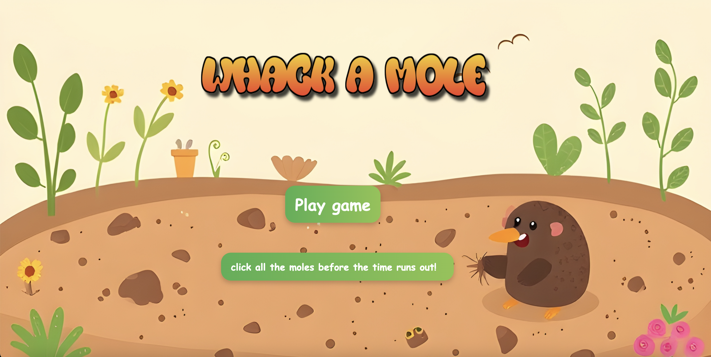
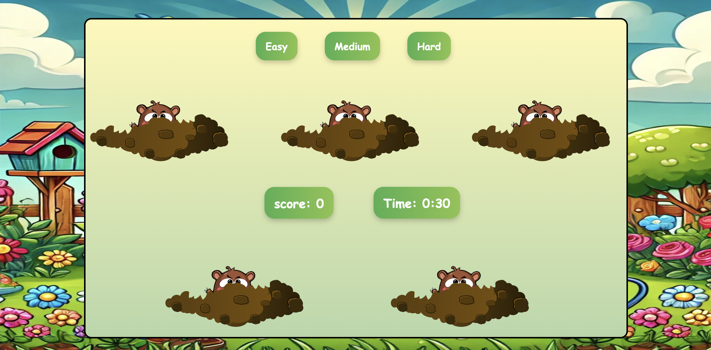

## Features

### Overview 

- **Interactive gameplay**  
  - Users can play an engaging game where they click on moles that pop up at random intervals and positions on the screen.

- **Difficulty levels**  
  - The game offers three difficulty levels:  
    - **Easy**: Moles appear and stay visible for a longer duration.  
    - **Medium**: Moles appear at moderate speed, requiring quicker reaction times.  
    - **Hard**: Moles appear and disappear rapidly, requiring rapid reaction times.

- **Dynamic score tracking**  
  - The game keeps track of the player's score in real time, increasing with each successful hit.

- **Time-limited rounds**  
  - Each game session has a set time limit, creating a fun challenge to achieve the highest possible score before the timer runs out.

- **Responsive design**  
  - The game is optimized for both desktop and Tablet. Due to the nature of the game, it is not possible for the game to be run on mobile. 

- **Restart functionality**  
  - The game resets after each round and the player is able to select a higher difficulty 

- **Visual feedback**  
  - When a mole is successfully clicked, the game provides visual feedback to indicate the hit --> the mole shifts downwards.
 
- **End game feedback**
  - Following the completion of a round the game provides an alert returning your score

### Detailed Components 

-**Title screen**
  - This is on the title screen giving users a short description of the game and once the play game button is clicked the page is redirected to the main game screen
    

- **Game Board**  
  - This is the main area where the game takes place. It is a grid of holes where moles randomly appear for the user to click. It is a dynamic element that updates based on the game state.  
  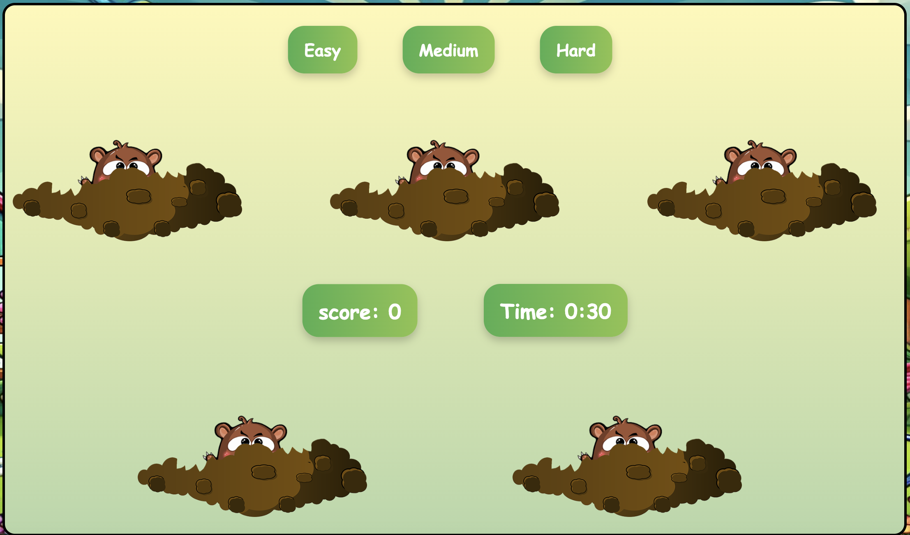

- **Moles**  
  - Moles are the targets that appear in random holes on the game board. The user must click on them to score points. The speed and frequency of mole appearances depend on the selected difficulty level.  
  

- **Score Counter**  
  - This is used to display the user's current score in real-time. Each successful click on a mole increases the score. It updates dynamically as the game progresses.  
  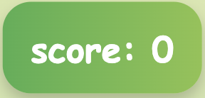

- **Timer**  
  - A countdown timer that shows the remaining time for the game round. The game ends when the timer reaches zero, and the final score is displayed.  
  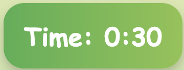

- **Difficulty Selector**  
  - This allows the user to select the game's difficulty level: easy, medium, or hard. The difficulty level determines how quickly the moles appear and disappear. Alert is also given to confirm user selection  
  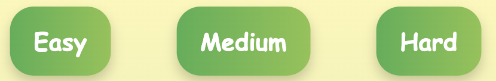
  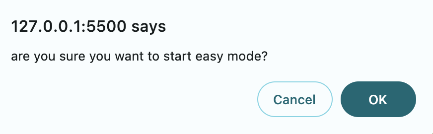

- **Game Over Feedback**  
  - After the timer ends, a "Game Over" message is displayed along with the user's final score. It provides visual feedback and encourages the user to try again.  
  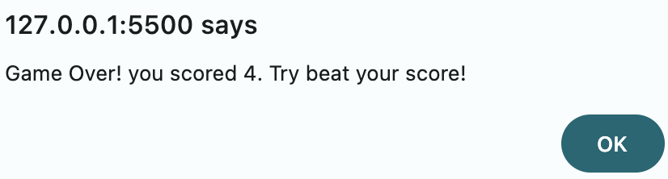

### Features Left to Implement

- Add accessibility options, and change colours and text.
- Add a description on the title screen indicating how to play 
- responsiveness to tablets 

## Testing

The testing conducted for this game focused on ensuring that the user interaction elements function correctly. This includes:

1. **Clicking**: Ensuring users can successfully click on moles when they appear.
2. **Timing**: Verifying that moles appear and disappear based on the selected difficulty level (easy, medium, hard), with the intervals between appearances adjusted accordingly.
3. **Reset Functionality**: Confirming that clicking the reset button removes visual feedback and returns the game to its initial state with moles in their original positions.
4. **Feedback Mechanism**: After clicking on a mole, users receive visual feedback indicating whether their click was successful or not.
5. **Game over reset functionality**: After the game is over, the game resets with all moles set to their initial state, the timer reset to 0 and score also reset to 0.

Future testing will include:
- **Device Compatibility**: Ensuring the game functions smoothly across different devices (desktop, and tablet).
- **Accessibility Testing**: Assessing how accessible the game is to all users, including those with disabilities, by implementing necessary adjustments for improved usability.

### User Stories

#### User Story 1  
- As a **Casual Gamer**, I want to **engage in a fun and challenging arcade game** so that I can **test and improve my reaction skills**.

#### User Story 2  
- I want to **challenge myself with different difficulty levels**.  So that I can **track my progress and improve my performance**.

### Validator Testing

- HTML
  - No errors were returned when passing through the official [W3C Validator](https://validator.w3.org)
  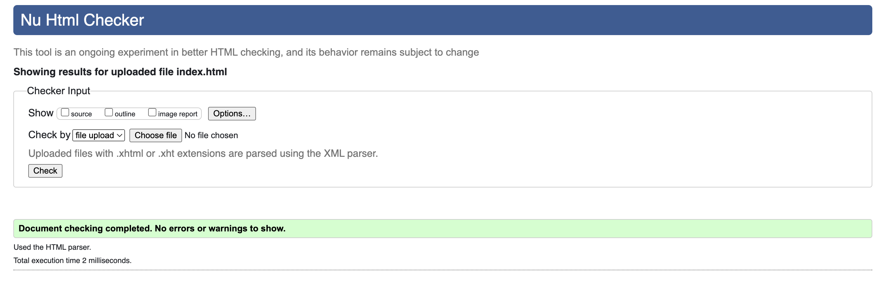
  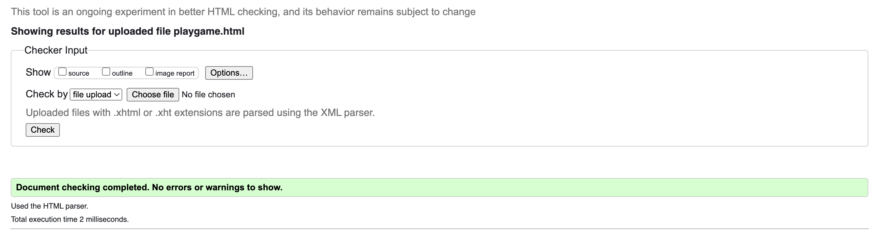
- CSS
  - No errors were returned when passing through official [W3C Validcator CSS](https://jigsaw.w3.org/css-validator/)
  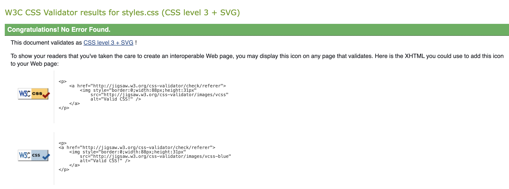

- JavaScript
  - No errors were returned when passing through [JSHint](https://jshint.com)
  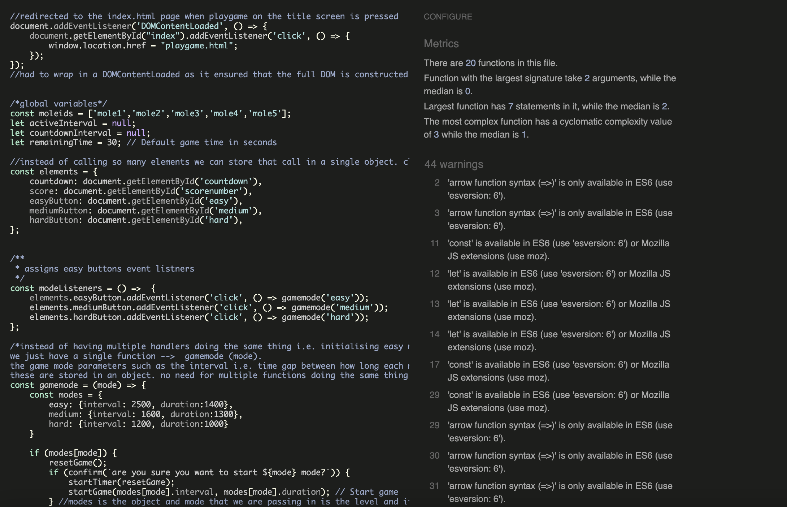

- Lighthouse
  - Overall performance of the website is good
  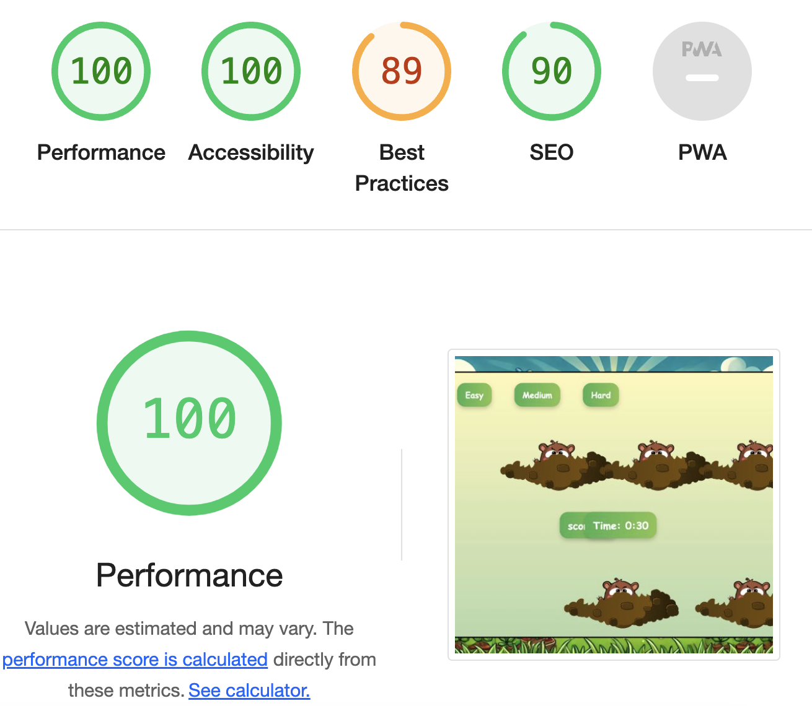

<!-- CONTACT -->
## Contact

Shahan Khan - k.shahan786@gmail.com

Project Link: ((https://github.com/Shahan15/Whack-a-mole-))

(<a href="#readme-top">back to top</a>)

